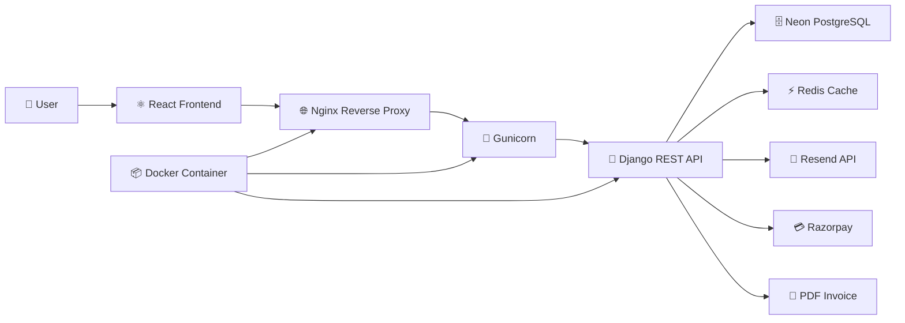
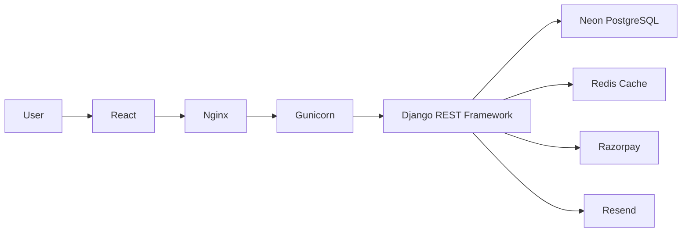
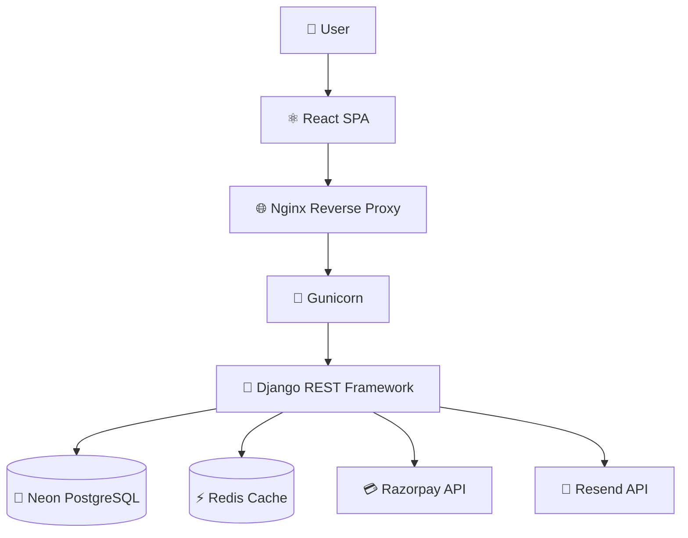
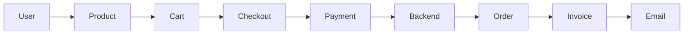

# 🛒 Smart Commerce

<div align="center">

### Production-Inspired Full Stack E-Commerce Platform

A full stack e-commerce application built using **React**, **Django REST Framework**, **Neon PostgreSQL**, **Redis**, **Docker**, **Nginx**, **Gunicorn**, and **Razorpay** with a strong focus on secure authentication, scalable backend architecture and production-inspired deployment.


</div>

<p align="center">

## 🔗 Live Demo

> The live deployment is currently under Razorpay website verification.
> The demo link will be updated once verification is completed.
  
</a>

## 💻 Source Code

👉 [View the GitHub Repository](https://github.com/sumayya-git/smart_ecommerce)
<a href="https://github.com/sumayya-git/smart_ecommerce">
    
</a>

</p>


# 🏗️ System Architecture



# 📊 Project Highlights

| Metric | Value |
|--------|-------|
| Architecture | Production-inspired |
| Frontend | React |
| Backend | Django REST Framework |
| Database | Neon PostgreSQL |
| Authentication | Django Auth + Session Auth + Cookie-based JWT |
| Security | HttpOnly Cookies + CSRF Protection |
| Cache | Redis |
| Background Tasks | Celery Architecture |
| Email Service | Resend API |
| Payment Gateway | Razorpay |
| Containerization | Docker + Docker Compose |
| Reverse Proxy | Nginx |
| WSGI Server | Gunicorn |
| Deployment | Render |
| Invoice | PDF + QR Code |
| Order Management | Timeline + Return + Refund |


# 🚀 Feature Summary

| Category | Highlights |
|----------|------------|
| 🛍️ E-Commerce | Product Catalog, Categories, Cart, Buy Now, Checkout |
| 🔐 Security | Django Authentication, Session Authentication, Cookie-based JWT, HttpOnly Cookies, CSRF Protection |
| 💳 Payments | Razorpay, Cash on Delivery |
| 📦 Orders | Order Timeline, Return Workflow, Refund Workflow |
| 📄 Documents | PDF Invoice, QR Code Verification |
| 📧 Notifications | Resend API Email Notifications |
| ⚡ Performance | Redis Caching |
| 🏗️ Architecture | Django REST API, Docker, Nginx, Gunicorn |
| ☁️ Deployment | Render + Docker |
| 🛠️ Engineering | Logging, Custom Permissions, Environment Variables |


# 📸 Application Preview


> Screenshots will be added soon.


# 📑 Table of Contents

- [Overview](#-overview)
- [Features](#-features)
- [System Architecture](#-system-architecture)
- [Authentication & Security](#-authentication--security)
- [Functional Modules](#-functional-modules)
- [Tech Stack](#-tech-stack)
- [Project Structure](#-project-structure)
- [API Overview](#-api-overview)
- [Getting Started](#-getting-started)
- [Docker](#-docker)
- [Environment Variables](#-environment-variables)
- [Deployment Architecture](#-deployment-architecture)
- [Engineering Decisions](#-engineering-decisions)
- [Testing](#-testing)
- [Future Improvements](#-future-improvements)
- [Conclusion](#-conclusion)

---


# 📖 Overview

Smart Commerce is a production-inspired full stack e-commerce platform built to demonstrate modern software engineering practices using React, Django REST Framework, and PostgreSQL.

The application goes beyond a traditional CRUD project by incorporating secure authentication, production-oriented deployment, caching, containerization, payment integration, and modular backend architecture.

The project was designed with scalability and maintainability in mind, following real-world backend development practices wherever practical.

### Key Engineering Highlights

- RESTful API architecture using Django REST Framework
- React single-page application with service-based API layer
- Neon PostgreSQL as the production database
- Cookie-based JWT authentication with HttpOnly cookies
- CSRF protection and custom authentication
- Redis caching for improved API performance
- Celery architecture integrated into the codebase for asynchronous background processing
- Resend API for transactional email delivery in the live deployment
- PDF invoice generation with QR code verification
- Razorpay payment gateway integration
- Dockerized deployment using Docker, Gunicorn, and Nginx
- Environment variable based configuration
- Logging and custom permission handling
- Return, refund, and order tracking workflows

> **Note**
>
> The project includes a complete Celery + Redis architecture. During local development, asynchronous background processing is supported through Celery workers. The live deployment on Render's Free plan uses synchronous Resend API calls because free background worker services are not available. The underlying architecture remains ready for asynchronous execution in production environments that support background workers.


---

# ✨ Features

## 👤 Customer Features

- User Registration & Login
- Secure Cookie-based Authentication
- Product Catalog
- Category Browsing
- Product Details
- Shopping Cart
- Buy Now
- Checkout
- Razorpay Payment Integration
- Cash on Delivery (COD)
- Order History
- Order Tracking Timeline
- PDF Invoice Download
- QR Code Invoice Verification
- Email Notifications

---

## 👨‍💼 Admin Features

- Admin Dashboard
- Product Management
- Category Management
- Order Management
- Order Status Updates
- Revenue Reports
- Return Request Management
- Refund Workflow
- Custom Permissions
- Backend Logging

---

## ⚙️ Engineering Features

- Django REST Framework APIs
- Cookie-based JWT Authentication
- Django Session Authentication
- HttpOnly Cookies
- CSRF Protection
- Redis Caching
- Celery Architecture (Codebase)
- Resend API Email Service
- Docker Containerization
- Docker Compose
- Nginx Reverse Proxy
- Gunicorn WSGI Server
- Neon PostgreSQL Database
- Environment Variable Configuration
- Modular Service Layer
- Production-inspired Project Structure

---

# ⚙️ Tech Stack

| Category | Technologies |
|----------|--------------|
| **Frontend** | React, JavaScript, HTML5, CSS3 |
| **Backend** | Django, Django REST Framework (DRF) |
| **Authentication** | Django Authentication, Session Authentication, Custom Cookie-based JWT Authentication |
| **Security** | HttpOnly Cookies, CSRF Protection, Custom Permissions |
| **Database** | Neon PostgreSQL |
| **Caching** | Redis |
| **Background Processing** | Celery Architecture, Redis Broker |
| **Email Service** | Resend API |
| **Payments** | Razorpay, Cash on Delivery (COD) |
| **Documents** | PDF Invoice Generation, QR Code Verification |
| **Web Server** | Gunicorn |
| **Reverse Proxy** | Nginx |
| **Containerization** | Docker, Docker Compose |
| **Deployment** | Render |
| **Version Control** | Git, GitHub |
| **Configuration** | Environment Variables (.env) |
| **Logging** | Django Logging |

---

# 🏗 System Architecture



---

# 🔐 Authentication & Security

Security was a key consideration throughout the development of Smart Commerce. The application follows multiple layers of authentication and request protection to provide a secure user experience.

## Authentication

- Django Authentication
- Django Session Authentication
- Custom Cookie-based JWT Authentication
- Protected REST API Endpoints
- Authenticated User Access Control

## Security Measures

- HttpOnly Cookies for JWT storage
- CSRF Protection
- Custom Authentication Class
- Custom Permission Classes
- Input Validation using Django REST Framework Serializers
- Environment Variable Configuration
- Secure API Response Handling

## Request Flow

```text
User Login
      │
      ▼
Django Authentication
      │
      ▼
JWT Generated
      │
      ▼
Stored in HttpOnly Cookie
      │
      ▼
Authenticated Requests
      │
      ▼
Custom CookieJWTAuthentication
      │
      ▼
Protected Django REST API
```

### Highlights

- JWT tokens are stored in HttpOnly cookies instead of browser localStorage.
- CSRF protection is enabled for authenticated requests.
- Authentication is enforced using a custom `CookieJWTAuthentication` class.
- Sensitive configuration values are managed using environment variables.
- Permission checks are applied to protected administrative endpoints.es

---

# ⚡ Background Processing

The application is architected to support asynchronous background task processing using **Celery** and **Redis**.

During local development, Celery workers process long-running tasks asynchronously, keeping API responses fast and improving scalability.

For the live deployment, the application is hosted on the **Render Free Plan**, which does not provide free background worker services. To ensure the application remains fully functional without additional infrastructure costs, transactional emails are sent synchronously using the **Resend API**.

This deployment decision affects only the execution strategy. The complete Celery architecture remains integrated into the codebase and can be enabled by deploying a dedicated Celery worker in any production environment that supports background services.

## Local Development Architecture

```text
Django REST API
        │
        ▼
   Redis Broker
        │
        ▼
 Celery Worker
        │
        ▼
 Background Tasks
```

## Live Deployment

```text
Django REST API
        │
        ▼
    Resend API
        │
        ▼
 Order Confirmation Email
```

# 🏗️ Engineering Decisions

This project was developed with a production-oriented mindset rather than focusing only on feature implementation.

## Authentication

JWT tokens are stored in **HttpOnly Cookies** to reduce exposure to client-side JavaScript attacks while maintaining secure authenticated sessions.

---

## REST API Design

The backend follows a RESTful architecture using Django REST Framework, allowing the frontend and backend to remain independently maintainable.

---

## Redis Caching

Redis is used to cache frequently accessed data, reducing database queries and improving response times.

---

## Background Processing

The application includes a complete Celery + Redis architecture.

During local development, asynchronous task execution is supported through Celery workers.

For the live deployment on Render Free, transactional emails are sent synchronously using the Resend API due to the absence of free background worker services.

This deployment strategy preserves the existing architecture while keeping the application fully functional.

---

## Containerization

Docker and Docker Compose provide consistent development and deployment environments across different systems.

---

## Reverse Proxy

Nginx acts as the reverse proxy, forwarding incoming requests to the Gunicorn application server.

---

## Production Deployment

Gunicorn serves the Django application, while Render hosts the containerized application using Neon PostgreSQL as the managed database service.
---

# 🐳 Deployment Stack

- Docker
- Docker Compose
- Nginx
- Gunicorn
- Render
- Neon PostgreSQL
- Redis

---

# 📂 Project Structure

```text
smart_ecommerce/

├── ecommerce_project/
├── store/
│   ├── api/
│   ├── templates/
│   ├── models.py
│   └── admin.py
│
├── frontend-spa/
│   ├── public/
│   └── src/
│       ├── components/
│       ├── pages/
│       ├── services/
│       └── constants/
│
├── media/
├── staticfiles/
├── Dockerfile
├── docker-compose.yml
├── nginx.conf
├── render.yaml
├── requirements.txt
├── manage.py
└── README.md
```

---

# 📷 Screenshots

- Home
- Product Details
- Shopping Cart
- Checkout
- Orders
- Invoice
- Admin Dashboard

(Add screenshots here)

---

# 💡 Engineering Highlights

- Modular React architecture
- Django REST Framework APIs
- Secure authentication
- Redis caching
- Docker containerization
- Nginx reverse proxy
- Gunicorn production server
- Razorpay payment verification
- PDF invoice generation
- Email automation
- Production-inspired deployment

---

# 📚 Documentation

Detailed architecture, deployment notes, engineering decisions and implementation details are available in:

**PROJECT_DOCUMENTATION.md**

---

# ⭐ Conclusion

Smart Commerce demonstrates practical experience in full stack development, REST API design, authentication, payment integration, caching, containerization and deployment using a production-inspired architecture.

# 🛒 Smart Commerce

<div align="center">

### Production-Inspired Full Stack E-Commerce Platform

A modern full stack e-commerce application built using **React**, **Django REST Framework**, **Neon PostgreSQL**, **Redis**, **Docker**, **Nginx**, **Gunicorn**, and **Razorpay**.

The project focuses on secure authentication, scalable backend architecture, production-inspired deployment, payment processing and modern software engineering practices.


</div>

---

# 📖 Overview

Smart Commerce is a production-inspired full stack e-commerce platform developed to simulate how modern web applications are designed, secured and deployed.

Rather than focusing only on CRUD functionality, the project demonstrates production-oriented software engineering concepts including REST API architecture, secure authentication, payment gateway integration, Docker-based deployment, Redis caching and scalable backend design.

The frontend is built with **React**, while the backend is powered by **Django REST Framework**, providing a clean separation between presentation, business logic and data access layers.

---

---

# 🚀 Live Demo

> **Live Application:**  
> https://YOUR-RENDER-URL.onrender.com

> **GitHub Repository:**  
> https://github.com/sumayya-git/smart_ecommerce

---

# 📊 Project Snapshot

| Category | Details |
|----------|---------|
| Project Type | Production-Inspired Full Stack E-Commerce |
| Frontend | React |
| Backend | Django REST Framework |
| Database | Neon PostgreSQL |
| Authentication | Django Authentication + Session Authentication + Cookie-based JWT Support |
| Security | HttpOnly Cookies + CSRF Protection |
| Cache | Redis |
| Background Architecture | Celery (Development) |
| Email Service | Resend API |
| Payments | Razorpay |
| Reverse Proxy | Nginx |
| Application Server | Gunicorn |
| Containerization | Docker & Docker Compose |
| Deployment | Render |

---

# 🏗 High-Level Architecture



---

# 🔄 Order Processing Flow



---

# 🔐 Authentication Flow

```mermaid
flowchart LR

User Login

--> Django Authentication

--> Session Authentication

--> HttpOnly Cookie

--> CSRF Validation

--> Protected REST APIs
```

---

# 📷 Application Preview

| Customer | Admin |
|----------|-------|
| 🏠 Home Page | 📊 Dashboard |
| 📦 Product Details | 📦 Product Management |
| 🛒 Shopping Cart | 📂 Category Management |
| 💳 Checkout | 📋 Order Management |
| 📜 Order History | 📈 Revenue Reports |
| 📄 PDF Invoice | 🔄 Refund Workflow |

> 📸 Screenshots will be added in the **docs/screenshots** directory.

---

# ⭐ Project Highlights

- Production-inspired architecture
- React + Django REST Framework
- Secure browser authentication
- RESTful API design
- Redis caching
- Razorpay payment integration
- PDF invoice generation
- QR code invoice verification
- Email automation using Resend API
- Dockerized deployment
- Nginx reverse proxy
- Gunicorn production server
- Modular frontend service layer
- Production-ready configuration

---

# ✨ Key Features

## 👤 Customer Features

- Secure User Registration & Login
- Product Catalogue
- Product Categories
- Product Details
- Shopping Cart
- Buy Now
- Checkout
- Cash on Delivery (COD)
- Razorpay Online Payments
- Order History
- Order Tracking Timeline
- PDF Invoice Download
- QR Code Invoice Verification
- Order Confirmation Emails
- Return Request
- Refund Status Tracking

---

## 👨‍💼 Admin Features

- Product Management
- Category Management
- Order Management
- Order Status Updates
- Revenue Dashboard
- Revenue Reports
- Return Request Management
- Refund Approval Workflow
- Protected Administrative APIs

---

## ⚙️ Engineering Features

- RESTful API Architecture
- Django REST Framework
- Modular React Service Layer
- Cookie-based Authentication
- Session Authentication
- HttpOnly Cookies
- CSRF Protection
- Custom Permission Classes
- Redis Caching
- Docker Containerization
- Docker Compose
- Gunicorn Application Server
- Nginx Reverse Proxy
- Environment Variable Configuration
- Logging Support
- Production-Inspired Deployment

---

# 🛠 Technology Stack

| Category | Technologies |
|-----------|--------------|
| Frontend | React, React Router, Axios, Bootstrap |
| Backend | Python, Django, Django REST Framework |
| Authentication | Django Authentication, Session Authentication, Cookie-based JWT Support |
| Security | HttpOnly Cookies, CSRF Protection, Custom Permissions |
| Database | Neon PostgreSQL |
| Cache | Redis |
| Background Architecture | Celery (Development Architecture) |
| Email | Resend API |
| Payments | Razorpay |
| Web Server | Gunicorn |
| Reverse Proxy | Nginx |
| Containerization | Docker, Docker Compose |
| Deployment | Render |

---

# 🎯 Engineering Highlights

This project was built by applying several production-inspired engineering practices rather than implementing only functional requirements.

### Security

- Browser-oriented authentication
- HttpOnly Cookie support
- CSRF protection
- Protected administrative APIs
- Server-side validation

### Performance

- Redis caching
- Optimized REST API communication
- Modular frontend service layer

### Scalability

- Decoupled frontend and backend
- Containerized deployment
- Celery-ready architecture
- Environment-based configuration

### Maintainability

- Reusable React components
- Dedicated service modules
- Centralized serializers
- Organized project structure
- Modular backend architecture

---

# 📦 Functional Modules

| Module | Status |
|---------|--------|
| Authentication | ✅ |
| Product Catalogue | ✅ |
| Categories | ✅ |
| Shopping Cart | ✅ |
| Buy Now | ✅ |
| Checkout | ✅ |
| Razorpay Integration | ✅ |
| Cash on Delivery | ✅ |
| Order History | ✅ |
| Order Tracking | ✅ |
| PDF Invoice | ✅ |
| QR Code Verification | ✅ |
| Email Notifications | ✅ |
| Return Workflow | ✅ |
| Refund Workflow | ✅ |
| Revenue Reports | ✅ |
| Redis Cache | ✅ |
| Docker Deployment | ✅ |
| Logging | ✅ |

---

---

# 📂 Project Structure

The project follows a modular architecture with a clear separation between the frontend, backend, deployment configuration and application resources.

```text
smart_ecommerce/

├── ecommerce_project/          # Django project configuration
├── store/
│   ├── api/
│   │   ├── authentication.py
│   │   ├── permissions.py
│   │   ├── serializers.py
│   │   ├── tasks.py
│   │   ├── resend.py
│   │   ├── logging.py
│   │   ├── utils.py
│   │   ├── urls.py
│   │   └── views.py
│   │
│   ├── templates/
│   ├── models.py
│   ├── admin.py
│   └── apps.py
│
├── frontend-spa/
│   ├── public/
│   └── src/
│       ├── components/
│       ├── pages/
│       ├── services/
│       ├── constants/
│       ├── api.js
│       └── App.js
│
├── media/
├── staticfiles/
├── Dockerfile
├── docker-compose.yml
├── nginx.conf
├── render.yaml
├── Procfile
├── requirements.txt
├── manage.py
└── README.md
```

---

# 🏛 Backend Architecture

The backend is built with **Django REST Framework** and follows a modular design.

Responsibilities are separated into dedicated modules:

- Authentication
- Authorization
- API Views
- Serializers
- Payment Processing
- Email Services
- Logging
- Utility Functions

Business rules remain on the server, while serializers handle validation and data transformation.

---

# ⚛ Frontend Architecture

The frontend is implemented as a React Single Page Application.

API requests are organized into dedicated service modules:

- authService.js
- cartService.js
- orderService.js
- paymentService.js
- productService.js

This keeps UI components focused on presentation while API communication remains reusable and maintainable.

---

# 🐳 Docker Deployment

The application is containerized using Docker to provide a consistent development and deployment environment.

Docker packages the complete application stack, reducing environment-specific issues and simplifying deployment.

The deployment includes:

- React Frontend
- Django Backend
- Gunicorn
- Nginx

---

# 🌐 Reverse Proxy

Nginx is used as the reverse proxy.

Responsibilities include:

- Serving the React application
- Forwarding API requests to Django
- Serving static files
- Serving media files

This deployment approach closely resembles real-world production environments.

---

# 🚀 Production Server

Instead of using Django's development server, Gunicorn serves the application in the deployed environment.

Benefits include:

- Production-ready request handling
- Better concurrency
- Improved reliability
- Stable deployment

---

# 🚀 Getting Started

## Prerequisites

Before running the project locally, ensure the following tools are installed:

- Python 3.12+
- Node.js 20+
- PostgreSQL (or Neon PostgreSQL)
- Redis
- Docker
- Docker Compose
- Git

---

## Clone the Repository

```bash
git clone https://github.com/sumayya-git/smart_ecommerce.git

cd smart_ecommerce
```

---

## Configure Environment Variables

Create a `.env` file in the project root and configure the required environment variables.

Example:

```env
SECRET_KEY=

DEBUG=True

DATABASE_URL=

REDIS_URL=

RESEND_API_KEY=

RAZORPAY_KEY_ID=

RAZORPAY_KEY_SECRET=
```

---

## Install Backend Dependencies

```bash
pip install -r requirements.txt
```

---

## Install Frontend Dependencies

```bash
cd frontend-spa

npm install
```

---

## Run with Docker

```bash
docker compose up --build
```

The application will start with:

- React Frontend
- Django REST API
- Nginx Reverse Proxy
- Gunicorn Application Server
- Redis

---

## Run Without Docker

Backend

```bash
python manage.py migrate

python manage.py runserver
```

Frontend

```bash
cd frontend-spa

npm start
```

# 🔑 Environment Variables

Sensitive configuration values are stored using environment variables instead of hardcoding credentials.

| Variable | Description |
|----------|-------------|
| SECRET_KEY | Django Secret Key |
| DEBUG | Debug Mode |
| DATABASE_URL | Neon PostgreSQL Connection URL |
| REDIS_URL | Redis Server URL |
| RESEND_API_KEY | Resend Email API Key |
| RAZORPAY_KEY_ID | Razorpay Public Key |
| RAZORPAY_KEY_SECRET | Razorpay Secret Key |
| ALLOWED_HOSTS | Allowed Django Hosts |
| CSRF_TRUSTED_ORIGINS | Trusted CSRF Origins |

> **Important**
>
> Secrets are intentionally excluded from the repository and must be provided through environment variables during deployment.
---

# 📊 Logging

Logging is implemented throughout the backend to simplify debugging and monitoring.

Logged events include:

- User Login
- Failed Login Attempts
- Order Creation
- Payment Verification
- Order Cancellation
- Order Status Updates
- Application Errors

---

# 🚀 Deployment Flow

```mermaid
flowchart TD

Developer

--> GitHub

--> Render

--> Docker

--> Nginx

--> Gunicorn

--> Django REST Framework

--> Neon PostgreSQL

Django REST Framework --> Redis Cache

Django REST Framework --> Razorpay

Django REST Framework --> Resend API
```

---

# 💡 Why This Architecture?

Several architectural decisions were intentionally made to resemble modern production systems.

- React and Django are completely separated.
- REST APIs isolate frontend from backend.
- Redis reduces repeated database queries.
- Docker ensures deployment consistency.
- Gunicorn replaces Django's development server.
- Nginx acts as a reverse proxy.
- Browser authentication is protected using Session Authentication, HttpOnly Cookies and CSRF Protection.
- Environment variables protect sensitive credentials.
- Celery architecture is preserved for future background processing.

---

# 📷 Application Screenshots

The following screenshots demonstrate the major workflows of the application.

| Customer | Admin |
|----------|-------|
| 🏠 Home Page | 📊 Dashboard |
| 📦 Product Details | 📂 Category Management |
| 🛒 Shopping Cart | 📦 Product Management |
| 💳 Checkout | 📋 Order Management |
| 📜 Order History | 📈 Revenue Reports |
| 📄 PDF Invoice | 🔄 Return & Refund Workflow |

> **Note:** Screenshots can be placed inside `docs/screenshots/` and linked here.

---

# 🧪 Testing

The application has been manually tested across the following workflows.

## Authentication

- User Registration
- User Login
- User Logout
- Protected Routes
- Session Authentication
- CSRF Validation

## Product

- Product Listing
- Product Details
- Categories

## Cart

- Add to Cart
- Update Quantity
- Remove Item
- Buy Now

## Checkout

- Cash on Delivery
- Razorpay Payment Flow
- Payment Verification

## Orders

- Order Creation
- Order Tracking Timeline
- Return Request
- Refund Workflow

## Invoice

- PDF Invoice Generation
- QR Code Verification
- Email Delivery

---

# 🚀 Running the Project

Clone the repository

```bash
git clone https://github.com/sumayya-git/smart_ecommerce.git

cd smart_ecommerce
```

Backend

```bash
python -m venv venv

venv\Scripts\activate

pip install -r requirements.txt

python manage.py runserver
```

Frontend

```bash
cd frontend-spa

npm install

npm start
```

Docker

```bash
docker compose up --build
```

---

# 🔄 Background Processing

The application has been architected with **Celery** and **Redis** for asynchronous background task processing.

During local development, Celery workers execute background tasks using Redis as the message broker.

For the live deployment on **Render Free**, background workers are not deployed because the free plan does not provide background worker services and has resource limitations.

To keep the application fully functional, transactional emails are currently delivered synchronously using the **Resend API**.

The Celery architecture remains part of the codebase and can be enabled without changing business logic by deploying a dedicated Celery worker in future production environments.

---

# 📈 Future Improvements

The current architecture provides a strong foundation for future enhancements.

Planned improvements include:

- Dedicated Celery Worker deployment in production
- WebSocket-based live order updates
- Advanced product search, filtering and sorting
- Wishlist functionality
- Product reviews and ratings
- Coupon and promotion system
- Inventory notifications
- Automated CI/CD pipeline
- Unit and Integration Testing
- Kubernetes-based deployment for horizontal scalability

These enhancements can be integrated without significant architectural changes due to the modular design of the application.

---

# 🎓 Key Learning Outcomes

This project helped strengthen practical knowledge in:

- React Application Development
- Django REST Framework
- REST API Design
- Secure Browser Authentication
- Session Management
- HttpOnly Cookies
- CSRF Protection
- Redis Caching
- Payment Gateway Integration
- PDF Invoice Generation
- Email Automation
- Docker Containerization
- Nginx Reverse Proxy
- Gunicorn Deployment
- Environment Variable Management
- Production-inspired Deployment Practices

---

# 🤝 Contributing

Contributions, suggestions and feedback are welcome.

Feel free to fork the repository, submit pull requests or open issues for improvements.


# 📄 License

This project is licensed under the MIT License.

See the LICENSE file for more information.

# ⭐ Support

If you found this project useful or interesting, please consider giving it a ⭐ on GitHub.

Your support is greatly appreciated.

---


# 📬 Contact

**Developer:** Sumayya

GitHub: https://github.com/sumayya-git

LinkedIn: *(Add your LinkedIn profile after creating or updating it.)*

---

# ⭐ Conclusion

Smart Commerce is a production-inspired full stack e-commerce application developed using React and Django REST Framework with a strong focus on security, maintainability, modular architecture and deployment best practices.

The project demonstrates practical implementation of REST APIs, secure authentication, Redis caching, Docker containerization, payment gateway integration, PDF invoice generation and production-oriented deployment strategies.

Although the live deployment uses synchronous email delivery because of Render Free plan limitations, the codebase preserves a complete Celery architecture that can be enabled in production environments supporting background workers.

This project reflects modern full stack development practices while emphasizing clean architecture, scalability and real-world engineering decisions.

---

# 🏆 Project Highlights

✔ Production-inspired Full Stack Architecture

✔ React + Django REST Framework

✔ Secure Browser Authentication

✔ Cookie-based Session Management

✔ HttpOnly Cookies & CSRF Protection

✔ Redis Caching

✔ Razorpay Payment Integration

✔ PDF Invoice Generation

✔ QR Code Invoice Verification

✔ Dockerized Deployment

✔ Nginx Reverse Proxy

✔ Gunicorn Production Server

✔ Environment-based Configuration

✔ Production-inspired Background Task Architecture

---

# 📌 Repository Statistics

- **Frontend:** React SPA
- **Backend:** Django REST Framework
- **Database:** Neon PostgreSQL
- **Deployment:** Render
- **Caching:** Redis
- **Payments:** Razorpay
- **Email:** Resend API
- **Containerization:** Docker
- **Reverse Proxy:** Nginx
- **Application Server:** Gunicorn

---


## ⭐ If you found this project interesting, consider giving it a star!