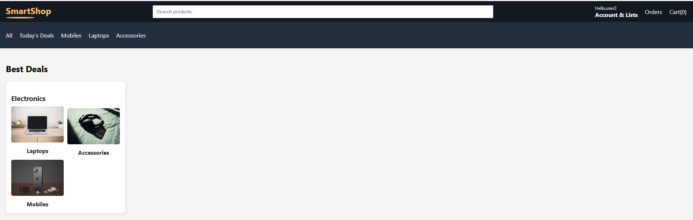
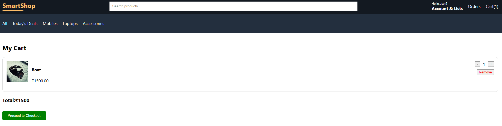
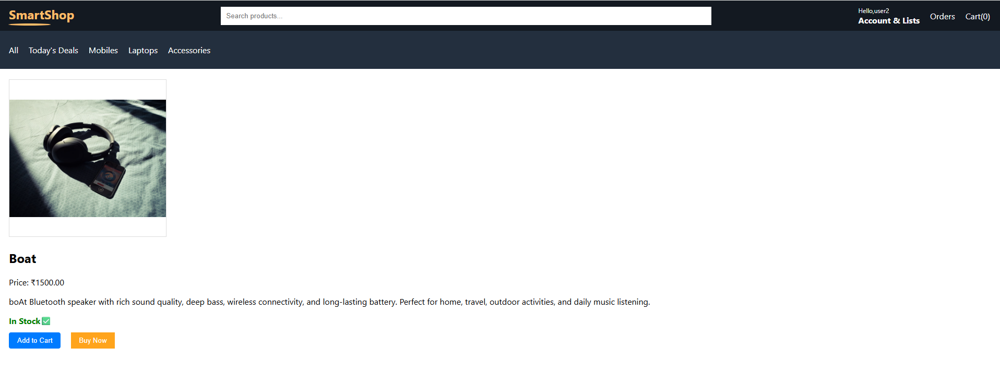
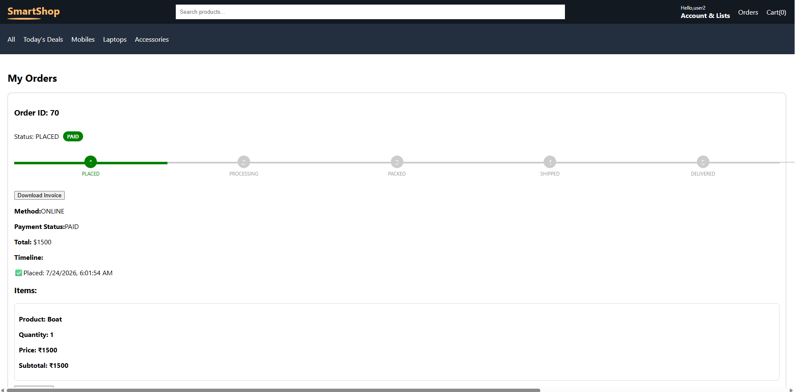

# 🛒 Smart Commerce

<div align="center">

## Production-Inspired Full Stack E-Commerce Platform

A modern full stack e-commerce application built using **React**, **Django REST Framework**, **Neon PostgreSQL**, **Redis**, **Docker**, **Nginx**, **Gunicorn**, and **Razorpay**.

The project focuses on secure authentication, scalable backend architecture, payment integration, production-inspired deployment, and modern software engineering practices.


</div>

---

# 🚀 Live Demo

🌐 **Live Application**

https://smart-ecommerce-2zen.onrender.com

<a href="https://smart-ecommerce-2zen.onrender.com">

</a>

---

# 💻 Source Code

👉 GitHub Repository

https://github.com/sumayya-git/smart_ecommerce

<a href="https://github.com/sumayya-git/smart_ecommerce">

</a>

---

# 📖 Overview

Smart Commerce is a production-inspired full stack e-commerce platform developed using **React** and **Django REST Framework**.

Rather than focusing only on CRUD operations, the project demonstrates real-world software engineering concepts including secure authentication, REST API architecture, payment gateway integration, Redis caching, Docker containerization, and production-inspired deployment.

The frontend is implemented as a React Single Page Application (SPA), while the backend exposes RESTful APIs using Django REST Framework. The project emphasizes clean architecture, modular design, security, maintainability, and scalability.

---

# 📊 Project Snapshot

| Category | Details |
|-----------|---------|
| Project Type | Production-Inspired Full Stack E-Commerce |
| Frontend | React |
| Backend | Django REST Framework |
| Database | Neon PostgreSQL |
| Authentication | Django Authentication + Session Authentication + Cookie-based JWT |
| Security | HttpOnly Cookies + CSRF Protection |
| Cache | Redis |
| Background Processing | Celery Architecture |
| Email Service | Resend API |
| Payments | Razorpay + Cash on Delivery |
| Reverse Proxy | Nginx |
| Application Server | Gunicorn |
| Containerization | Docker & Docker Compose |
| Deployment | Render |

---

# 🏗️ High-Level Architecture

```mermaid
flowchart TD

User

--> React SPA

--> Nginx

--> Gunicorn

--> Django REST Framework

--> Neon PostgreSQL

Django REST Framework --> Redis Cache

Django REST Framework --> Razorpay API

Django REST Framework --> Resend API
```

---

# ✨ Features

## 👤 Customer Features

- User Registration
- Secure Login
- Product Catalogue
- Categories
- Product Details
- Shopping Cart
- Buy Now
- Checkout
- Razorpay Payment
- Cash on Delivery (COD)
- Order History
- Order Tracking Timeline
- PDF Invoice Download
- QR Code Invoice Verification
- Email Notifications
- Return Request
- Refund Status Tracking

---

## 👨‍💼 Admin Features

- Admin Dashboard
- Product Management
- Category Management
- Order Management
- Order Status Updates
- Revenue Reports
- Return Request Management
- Refund Workflow
- Custom Permission Handling
- Backend Logging

---

## ⚙️ Engineering Features

- Django REST Framework APIs
- RESTful Architecture
- Cookie-based JWT Authentication
- Django Session Authentication
- HttpOnly Cookies
- CSRF Protection
- Redis Caching
- Celery Architecture
- Resend API Integration
- Razorpay Integration
- Docker Containerization
- Docker Compose
- Gunicorn
- Nginx Reverse Proxy
- Environment Variables
- Modular Service Layer
- Production-inspired Deployment

---

# 🛠️ Technology Stack

| Category | Technologies |
|-----------|--------------|
| **Frontend** | React, JavaScript, HTML5, CSS3, Bootstrap |
| **Backend** | Python, Django, Django REST Framework |
| **Authentication** | Django Authentication, Session Authentication, Cookie-based JWT Authentication |
| **Security** | HttpOnly Cookies, CSRF Protection, Custom Authentication, Custom Permissions |
| **Database** | Neon PostgreSQL |
| **Caching** | Redis |
| **Background Processing** | Celery + Redis Architecture |
| **Email Service** | Resend API |
| **Payments** | Razorpay, Cash on Delivery (COD) |
| **Documents** | PDF Invoice Generation, QR Code Verification |
| **Web Server** | Gunicorn |
| **Reverse Proxy** | Nginx |
| **Containerization** | Docker, Docker Compose |
| **Deployment** | Render |
| **Version Control** | Git, GitHub |
| **Configuration** | Environment Variables (.env) |
| **Logging** | Django Logging |

---

# 🔐 Authentication & Security

Security was a primary focus throughout the development of Smart Commerce. The application uses multiple layers of authentication and request protection to secure user data and administrative operations.

## Authentication

- Django Authentication
- Django Session Authentication
- Custom Cookie-based JWT Authentication
- Protected REST API Endpoints
- Authenticated User Access Control

---

## Security Measures

- JWT stored in **HttpOnly Cookies**
- CSRF Protection
- Custom Authentication Class
- Custom Permission Classes
- Django REST Framework Serializer Validation
- Environment Variable Configuration
- Secure API Response Handling

---

## Authentication Flow

```text
User Login
      │
      ▼
Django Authentication
      │
      ▼
JWT Generated
      │
      ▼
Stored in HttpOnly Cookie
      │
      ▼
Authenticated Requests
      │
      ▼
Custom CookieJWTAuthentication
      │
      ▼
Protected REST API Endpoints
```

---

## Security Highlights

- JWT tokens are stored inside **HttpOnly Cookies** instead of browser localStorage.
- CSRF protection is enabled for authenticated requests.
- Authentication is enforced using a custom `CookieJWTAuthentication` class.
- Sensitive configuration values are stored using environment variables.
- Custom permission classes protect administrative endpoints.
- Serializer validation helps prevent invalid or malicious input.

---

# ⚡ Background Processing

Smart Commerce is architected to support asynchronous task execution using **Celery** and **Redis**.

During local development, Celery workers execute background tasks asynchronously, improving response times and keeping API requests lightweight.

For the live deployment, the application runs on the **Render Free Plan**, which does not provide free background worker services. To keep the application fully functional without additional infrastructure, transactional emails are currently delivered synchronously using the **Resend API**.

The complete Celery architecture remains integrated into the codebase and can be enabled without changing business logic by deploying a dedicated Celery worker in production.

---

## Local Development Architecture

```text
Django REST API
        │
        ▼
   Redis Broker
        │
        ▼
   Celery Worker
        │
        ▼
 Background Tasks
```

---

## Live Deployment

```text
Django REST API
        │
        ▼
     Resend API
        │
        ▼
Order Confirmation Email
```

---

# 🏗️ Engineering Decisions

The project was developed with a production-oriented mindset rather than focusing only on implementing functional features.

## REST API Design

The backend follows a RESTful architecture using Django REST Framework, allowing the frontend and backend to remain independently maintainable.

---

## Authentication

JWT tokens are stored in **HttpOnly Cookies** to reduce exposure to client-side JavaScript attacks while maintaining secure authenticated sessions.

---

## Redis Caching

Redis is used to cache frequently accessed data, reducing repeated database queries and improving API response times.

---

## Background Processing

The application includes a complete Celery + Redis architecture.

During local development, asynchronous background processing is handled through Celery workers.

For the deployed version, transactional emails are delivered synchronously using the Resend API because Render's Free Plan does not support dedicated background workers.

---

## Containerization

Docker and Docker Compose provide consistent development and deployment environments, minimizing environment-specific issues.

---

## Reverse Proxy

Nginx acts as a reverse proxy, forwarding incoming requests to the Gunicorn application server while serving static assets efficiently.

---

## Production Deployment

Gunicorn serves the Django application, while Render hosts the Dockerized application using Neon PostgreSQL as the managed production database.

---

# 🏛 Backend Architecture

The backend is developed using **Django REST Framework (DRF)** and follows a modular architecture that separates business logic, authentication, validation, and API endpoints.

The application is designed to be maintainable, scalable, and easy to extend by organizing responsibilities into dedicated modules.

## Backend Responsibilities

- User Authentication
- Authorization
- Product Management
- Shopping Cart
- Checkout
- Payment Processing
- Order Management
- Invoice Generation
- Email Notifications
- Logging
- Utility Functions

Business rules remain inside the backend while serializers perform validation and data transformation before interacting with the database.

---

# ⚛ Frontend Architecture

The frontend is implemented as a **React Single Page Application (SPA)**.

React components focus on presentation while API communication is organized into reusable service modules.

## Service Layer

- authService.js
- productService.js
- cartService.js
- paymentService.js
- orderService.js

This separation improves maintainability and reduces duplicated code throughout the application.

---

# 🐳 Docker Deployment

The application is fully containerized using **Docker**.

Docker provides a consistent environment across development and deployment by packaging all required dependencies into containers.

The deployment stack includes:

- React Frontend
- Django REST Framework
- Gunicorn
- Nginx
- Redis

Docker Compose is used during development to orchestrate multiple services.

---

# 🌐 Reverse Proxy

Nginx is configured as the reverse proxy for the application.

Its responsibilities include:

- Serving the React frontend
- Forwarding API requests to Django REST Framework
- Serving static files
- Serving media files
- Improving request handling

Using Nginx makes the deployment architecture closer to a real production environment.

---

# 🚀 Production Server

Instead of Django's built-in development server, **Gunicorn** is used as the production WSGI server.

Benefits include:

- Production-ready request handling
- Better concurrency
- Improved reliability
- Efficient worker management
- Stable deployment

---

# 📂 Project Structure

```text
smart_ecommerce/

├── ecommerce_project/
│   ├── settings.py
│   ├── urls.py
│   ├── wsgi.py
│   └── asgi.py
│
├── store/
│   ├── api/
│   │   ├── authentication.py
│   │   ├── permissions.py
│   │   ├── serializers.py
│   │   ├── tasks.py
│   │   ├── resend.py
│   │   ├── logging.py
│   │   ├── utils.py
│   │   ├── urls.py
│   │   └── views.py
│   │
│   ├── templates/
│   ├── migrations/
│   ├── models.py
│   ├── admin.py
│   └── apps.py
│
├── frontend-spa/
│   ├── public/
│   └── src/
│       ├── components/
│       ├── pages/
│       ├── services/
│       ├── constants/
│       ├── api.js
│       └── App.js
│
├── media/
├── staticfiles/
├── Dockerfile
├── docker-compose.yml
├── nginx.conf
├── render.yaml
├── requirements.txt
├── manage.py
└── README.md
```

---

# 💡 Engineering Highlights

The project demonstrates several production-inspired engineering practices.

- Modular React architecture
- Django REST Framework APIs
- RESTful API design
- Cookie-based JWT Authentication
- HttpOnly Cookies
- CSRF Protection
- Redis Caching
- Razorpay Payment Integration
- PDF Invoice Generation
- QR Code Verification
- Email Automation using Resend API
- Docker Containerization
- Nginx Reverse Proxy
- Gunicorn Production Server
- Environment Variable Configuration
- Production-inspired Deployment

---

# 🚀 Getting Started

## Prerequisites

Before running the project locally, ensure the following software is installed:

- Python 3.12+
- Node.js 20+
- PostgreSQL (or Neon PostgreSQL)
- Redis
- Docker
- Docker Compose
- Git

---

## Clone the Repository

```bash
git clone https://github.com/sumayya-git/smart_ecommerce.git

cd smart_ecommerce
```

---

## Configure Environment Variables

Create a `.env` file in the project root.

Example:

```env
SECRET_KEY=

DEBUG=True

DATABASE_URL=

REDIS_URL=

RESEND_API_KEY=

RAZORPAY_KEY_ID=

RAZORPAY_KEY_SECRET=

ALLOWED_HOSTS=

CSRF_TRUSTED_ORIGINS=
```

---

## Install Backend Dependencies

```bash
pip install -r requirements.txt
```

---

## Install Frontend Dependencies

```bash
cd frontend-spa

npm install
```

---

## Run with Docker

```bash
docker compose up --build
```

Services started:

- React Frontend
- Django REST API
- Gunicorn
- Nginx
- Redis

---

## Run Without Docker

### Backend

```bash
python manage.py migrate

python manage.py runserver
```

### Frontend

```bash
cd frontend-spa

npm start
```

---

# 🔑 Environment Variables

Sensitive credentials are managed using environment variables instead of hardcoding secrets.

| Variable | Description |
|----------|-------------|
| SECRET_KEY | Django Secret Key |
| DEBUG | Debug Mode |
| DATABASE_URL | Neon PostgreSQL Connection URL |
| REDIS_URL | Redis Server URL |
| RESEND_API_KEY | Resend Email API Key |
| RAZORPAY_KEY_ID | Razorpay Public Key |
| RAZORPAY_KEY_SECRET | Razorpay Secret Key |
| ALLOWED_HOSTS | Allowed Django Hosts |
| CSRF_TRUSTED_ORIGINS | Trusted CSRF Origins |

> **Important**
>
> Secrets are intentionally excluded from the repository and must be supplied through environment variables.

---

# 📊 Logging

Logging is implemented throughout the backend to simplify debugging and monitoring.

Logged events include:

- User Registration
- User Login
- Failed Login Attempts
- Order Creation
- Payment Verification
- Payment Failure
- Order Cancellation
- Order Status Updates
- Return Requests
- Refund Processing
- Application Errors

---

# 🚀 Deployment Flow

```mermaid
flowchart TD

Developer

--> GitHub

--> Render

--> Docker

--> Nginx

--> Gunicorn

--> Django REST Framework

--> Neon PostgreSQL

Django REST Framework --> Redis Cache

Django REST Framework --> Razorpay API

Django REST Framework --> Resend API
```

---

# 💡 Why This Architecture?

Several architectural decisions were intentionally made to resemble modern production systems.

- React and Django are completely decoupled.
- REST APIs isolate the frontend from the backend.
- Redis reduces repeated database queries.
- Docker provides consistent deployment across environments.
- Gunicorn replaces Django's development server.
- Nginx serves as a production reverse proxy.
- Browser authentication uses Session Authentication, Cookie-based JWT, HttpOnly Cookies and CSRF Protection.
- Environment variables protect sensitive credentials.
- The codebase preserves a complete Celery architecture for future production deployments.

---

# 🧪 Testing

The application has been manually tested across the following workflows.

## Authentication

- User Registration
- User Login
- User Logout
- Protected Routes
- Session Authentication
- Cookie-based JWT Authentication
- CSRF Validation

---

## Product Management

- Product Listing
- Product Details
- Categories
- Search and Navigation

---

## Shopping Cart

- Add to Cart
- Update Quantity
- Remove Item
- Buy Now

---

## Checkout

- Cash on Delivery (COD)
- Razorpay Payment Flow
- Payment Verification

---

## Orders

- Order Creation
- Order History
- Order Tracking Timeline
- Return Request
- Refund Workflow

---

## Invoice

- PDF Invoice Generation
- QR Code Verification
- Email Delivery through Resend API

---

## Deployment

- Docker Build
- Render Deployment
- Gunicorn Configuration
- Nginx Reverse Proxy
- Neon PostgreSQL Connectivity
- Redis Integration

---

# 📷 Application Screenshots

The following screenshots demonstrate the major workflows of the application.

| Customer | Admin |
|----------|-------|
| 🏠 Home Page | 📊 Dashboard |
| 📦 Product Details | 📂 Category Management |
| 🛒 Shopping Cart | 📦 Product Management |
| 💳 Checkout | 📋 Order Management |
| 📜 Order History | 📈 Revenue Reports |
| 📄 PDF Invoice | 🔄 Return & Refund Workflow |

### 🏠 Home Page



### 🛒 Cart



### 💳 Checkout


### 📦 Product Details



### 📍 Order Tracking



### 🛠️ Admin Dashboard


---

# 📈 Future Improvements

The current architecture provides a strong foundation for future enhancements.

Planned improvements include:

- Dedicated Celery Worker deployment in production
- WebSocket-based live order updates
- Advanced product search, filtering and sorting
- Wishlist functionality
- Product reviews and ratings
- Coupon and promotion system
- Inventory notifications
- Automated CI/CD pipeline
- Unit and Integration Testing
- Kubernetes-based deployment for horizontal scalability

These enhancements can be integrated without significant architectural changes due to the modular architecture of the project.

---

# 🎓 Key Learning Outcomes

This project strengthened practical knowledge in:

- React Application Development
- Django REST Framework
- REST API Design
- Secure Browser Authentication
- Cookie-based JWT Authentication
- Session Management
- HttpOnly Cookies
- CSRF Protection
- Redis Caching
- Payment Gateway Integration
- PDF Invoice Generation
- QR Code Verification
- Email Automation using Resend API
- Docker Containerization
- Nginx Reverse Proxy
- Gunicorn Deployment
- Environment Variable Management
- Production-inspired Deployment Practices

---

# 🤝 Contributing

Contributions, suggestions, and feedback are welcome.

Feel free to fork the repository, submit pull requests, or open issues for improvements.

---

# 📬 Contact

**Developer:** Sumayya

**GitHub:** https://github.com/sumayya-git

**LinkedIn:** https://www.linkedin.com/in/sumayya-beevi-sak

---

# ⭐ Conclusion

Smart Commerce is a production-inspired full stack e-commerce application built using **React** and **Django REST Framework**, with a strong focus on security, maintainability, modular architecture, and deployment best practices.

The project demonstrates practical implementation of:

- RESTful API Development
- Secure Authentication
- Cookie-based JWT Authentication
- HttpOnly Cookies & CSRF Protection
- Redis Caching
- Razorpay Payment Integration
- PDF Invoice Generation
- QR Code Verification
- Email Automation using Resend API
- Docker Containerization
- Nginx Reverse Proxy
- Gunicorn Production Deployment

Although the live deployment uses synchronous email delivery because of Render Free plan limitations, the codebase preserves a complete **Celery + Redis architecture** that can be enabled in production environments supporting background workers.

This project reflects modern full stack development practices while emphasizing clean architecture, scalability, security, and real-world engineering decisions.

---

# 🏆 Project Highlights

- ✅ Production-inspired Full Stack Architecture
- ✅ React + Django REST Framework
- ✅ RESTful API Design
- ✅ Cookie-based JWT Authentication
- ✅ HttpOnly Cookies & CSRF Protection
- ✅ Redis Caching
- ✅ Razorpay Payment Integration
- ✅ PDF Invoice Generation
- ✅ QR Code Verification
- ✅ Resend API Email Automation
- ✅ Docker Containerization
- ✅ Nginx Reverse Proxy
- ✅ Gunicorn Production Server
- ✅ Neon PostgreSQL Database
- ✅ Environment Variable Configuration
- ✅ Celery-ready Architecture
- ✅ Render Deployment

---

## ⭐ Support

If you found this project useful or interesting, please consider giving it a ⭐ on GitHub.

Your support is greatly appreciated.